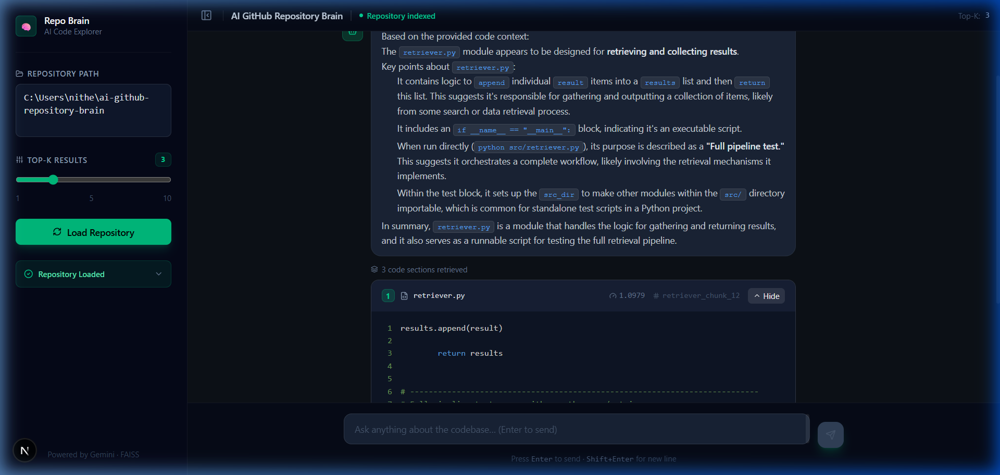

<div align="center">

# 🧠 AI GitHub Repository Brain

### Ask natural language questions about any codebase — powered by RAG, FAISS, and Gemini AI

[](https://python.org)
[](https://fastapi.tiangolo.com)
[](https://nextjs.org)
[](LICENSE)

</div>

---

## 📖 Description

**AI GitHub Repository Brain** is a full-stack AI application that lets you explore any local codebase through natural language. Point it at a repository, ask questions like *"How does the authentication system work?"* or *"Explain the chunking logic"*, and get precise answers backed by the actual source code.

Under the hood it builds a **RAG (Retrieval-Augmented Generation)** pipeline:
- Parses and semantically chunks every source file
- Generates vector embeddings and stores them in a **FAISS** index
- Retrieves the most relevant code sections per query
- Feeds them as context to **Google Gemini** for a grounded, accurate explanation

---

## 🖥️ Demo

> **Chat UI — Ask questions, get AI explanations with code snippets**



---

## ✨ Features

| Feature | Detail |
|---|---|
| 🔍 Semantic Code Search | Embedding-based similarity — finds relevant code even without exact keyword matches |
| 🤖 Gemini LLM Explanations | Grounded answers using retrieved source code as context |
| ⚡ FAISS Vector Index | Sub-millisecond nearest-neighbour retrieval at any repo scale |
| 💬 Chat Interface | Conversational Q&A with message history and syntax-highlighted code cards |
| 🎛️ Adjustable Top-K | Tune how many code sections the LLM sees per query |
| 🌗 Dark Developer UI | ChatGPT-style dark theme built with Next.js + Tailwind CSS |
| 🔌 REST API | Clean FastAPI backend — swap any frontend or call it from scripts |

---

## 🏗️ System Architecture

```
User Question
      │
      ▼
┌─────────────────────┐
│   Next.js Frontend  │  ← Chat UI, Sidebar, Code viewer
└────────┬────────────┘
         │  POST /ask
         ▼
┌─────────────────────┐
│  FastAPI Backend    │
│  (src/api.py)       │
└────────┬────────────┘
         │
    ┌────┴──────────────────────────┐
    │       RAG Pipeline            │
    │                               │
    │  repo_parser.py               │
    │    → Scan & filter code files │
    │  chunker.py                   │
    │    → Split into text chunks   │
    │  embedder.py                  │
    │    → sentence-transformers    │
    │       (all-MiniLM-L6-v2)      │
    │  retriever.py                 │
    │    → FAISS similarity search  │
    └────────────┬──────────────────┘
                 │ Top-K chunks
                 ▼
         ┌───────────────┐
         │  Gemini LLM   │  ← gemini-2.0-flash / 1.5-flash
         └───────┬───────┘
                 │
                 ▼
      Answer + Code Snippets
```

---

## 🛠️ Tech Stack

**Backend**
- [Python 3.10+](https://python.org)
- [FastAPI](https://fastapi.tiangolo.com) — REST API framework
- [Sentence Transformers](https://www.sbert.net) — `all-MiniLM-L6-v2` embeddings
- [FAISS](https://faiss.ai) — vector similarity search
- [LiteLLM](https://litellm.ai) — unified LLM interface
- [Google Gemini](https://ai.google.dev) — LLM for code explanation

**Frontend**
- [Next.js 14](https://nextjs.org) (App Router)
- [React](https://react.dev) + [TypeScript](https://typescriptlang.org)
- [Tailwind CSS](https://tailwindcss.com)
- [react-syntax-highlighter](https://github.com/react-syntax-highlighter/react-syntax-highlighter)
- [Lucide Icons](https://lucide.dev)

---

## 📂 Project Structure

```
ai-github-repository-brain/
│
├── src/
│   ├── api.py          # FastAPI app — /load_repo, /ask endpoints
│   ├── repo_parser.py  # Scan repository, collect source files
│   ├── chunker.py      # Split files into overlapping text chunks
│   ├── embedder.py     # Generate sentence-transformer embeddings
│   └── retriever.py    # FAISS index build + similarity search
│
├── frontend/
│   ├── app/
│   │   ├── layout.tsx
│   │   └── page.tsx        # Root page
│   ├── components/
│   │   ├── Sidebar.tsx     # Repo path input, Top-K slider, Load button
│   │   ├── Chat.tsx        # Chat bubbles + loading indicator
│   │   └── CodeBlock.tsx   # Expandable syntax-highlighted snippet card
│   ├── lib/
│   │   └── api.ts          # Typed fetch wrappers for the REST API
│   ├── package.json
│   └── next.config.ts
│
├── data/
├── .env.example        # API key template
├── requirements.txt
└── README.md
```

---

## ⚙️ Installation

### Prerequisites
- Python 3.10+
- Node.js 18+
- A [Google Gemini API key](https://aistudio.google.com/app/apikey)

### 1. Clone the repository

```bash
git clone https://github.com/your-username/ai-github-repository-brain.git
cd ai-github-repository-brain
```

### 2. Set up the Python environment

```bash
python -m venv .venv

# Windows
.venv\Scripts\activate

# macOS / Linux
source .venv/bin/activate

pip install -r requirements.txt
```

### 3. Configure your API key

```bash
cp .env.example .env
```

Open `.env` and add your key:

```env
GEMINI_API_KEY=your_gemini_api_key_here
```

### 4. Install frontend dependencies

```bash
cd frontend
npm install
cd ..
```

---

## 🚀 Running the Application

You need **two terminals** running simultaneously.

### Terminal 1 — Backend

```bash
# From the project root, with venv activated
uvicorn src.api:app --reload --port 8000
```

The API will be available at `http://localhost:8000`.  
Interactive docs: `http://localhost:8000/docs`

### Terminal 2 — Frontend

```bash
cd frontend
npm run dev
```

Open **http://localhost:3000** in your browser.

---

## 💡 Example Usage

1. **Load a repository** — paste any local path into the sidebar (e.g. `C:\Users\you\my-project`) and click **Load Repository**. The RAG pipeline runs once and builds the FAISS index.

2. **Ask questions** — type in the chat and press Enter:

   > *"How does the embedder generate vectors?"*  
   > *"What does the repo_parser filter out?"*  
   > *"Explain the FAISS retrieval process."*  
   > *"Where is the Gemini API called?"*

3. **View source code** — each answer includes collapsible code snippet cards showing the exact file sections the AI used, with file name, chunk ID, and similarity score.

---

## 🚧 Future Improvements

- [ ] Persistent FAISS index (save/load to disk — no re-indexing on restart)
- [ ] Multi-repo support — switch between indexed repositories
- [ ] Streaming LLM responses (Server-Sent Events)
- [ ] GitHub URL support — clone and index remote repos directly
- [ ] Session history — save and restore past Q&A sessions
- [ ] Re-ranking with cross-encoder models for higher precision
- [ ] Docker Compose setup for one-command deployment

---

## 📄 License

This project is licensed under the **MIT License** — see the [LICENSE](LICENSE) file for details.

---

## 👤 Author

**Nithesh Kannan**

> Built as a portfolio project demonstrating skills in AI engineering, RAG systems, vector databases, LLM integration, and full-stack development.

[](https://github.com/nitheshkannann)

---

<div align="center">

*If this project helped you, consider giving it a ⭐ on GitHub!*

</div>