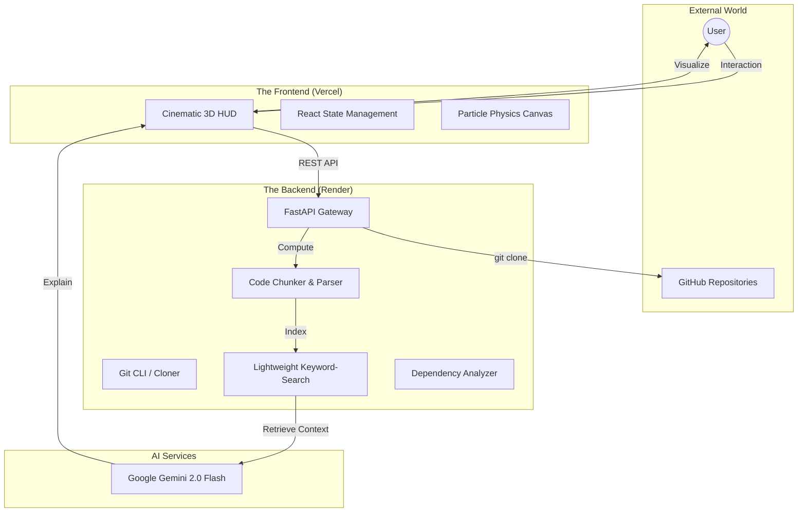

<div align="center">


# 🧠 AI GitHub Repository Brain
### The Cinematic 3D Code Explorer — Intelligence, Re-imagined.

[](https://ai-github-repository-brain.onrender.com)
[](https://repo-brain-frontend.vercel.app)
[](https://ai.google.dev)
[](LICENSE)

**Analyze code via Natural Language. Instant Cloning. 3D Visuals. Real-time Insights.**

[Live Production App](https://repo-brain-frontend.vercel.app) • [API Documentation](https://ai-github-repository-brain.onrender.com/docs) • [Contact Author](https://github.com/nitheshkannann)

</div>

---

## 📖 Table of Contents
1. [🌌 The Vision](#-the-vision)
2. [✨ Core Features](#-core-features)
3. [🏗️ Technical Architecture](#-technical-architecture)
4. [⚡ Dual-Mode RAG Engine](#-dual-mode-rag-engine)
5. [🎮 UI/UX: Cinematic 3D](#-uiux-cinematic-3d)
6. [🔌 Webhook Idea: Brainhook](#-webhook-idea-brainhook)
7. [🚀 Cloud Deployment](#-cloud-deployment)
8. [⚙️ Local Installation](#-local-installation)
9. [📂 Project Structure](#-project-structure)
10. [🚧 Roadmap & Status](#-roadmap--status)
11. [👤 Author & Acknowledgements](#-author--acknowledgements)

---

## 🌌 The Vision
Most code analysis tools are utilitarian and dull. **AI GitHub Repository Brain** is built to be the "Command Center" for your code. It doesn't just answer questions—it surfaces truths about your architecture through a premium, sci-fi inspired interface. 

Whether you're onboarding to a legacy codebase or auditing a new microservice, the "Brain" provides a cinematic journey through your logic, ensuring every line of code is understood, documented, and accessible.

---

## ✨ Core Features

### 📡 Instant Repository Ingestion
Paste a **GitHub URL** or a **Local Path**. The Brain immediately clones (if remote), parses, and filters source files using highly optimized file walking logic. No manual configuration or complex `.gitignore` rules required—it just works.

### 🤖 Gemini LLM Explanations
Powered by Google's **Gemini 2.0 / 1.5** models, the Brain provides grounded, context-aware answers. It doesn't guess; it retrieves the exact code sections and feeds them as ground truth to the LLM.

### 📜 Auto-Documentation Suite
*   **README Generation:** Analyzes your entire codebase to generate professional, standard-compliant README files.
*   **Setup Guide Generator:** Detects entry points and installation steps to build a one-click copy-pasteable guide for your team.

### 💠 Dual-Mode Exploration
Toggle between **"Load Repository"** for deep indexing and **"Ask Anything"** for contextual queries with adjustable **Top-K** thresholds to control the breadth of the AI's vision.

---

## 🏗️ Technical Architecture



---

## ⚡ Dual-Mode RAG Engine
To ensure stability on cloud environments with tight memory constraints (like Render's 512MB limit), we implemented a **hybrid retrieval strategy**.

### **1. Keyword-Search Mode (Cloud Optimized)**
- **How it works:** Uses frequency-based scoring to find relevant chunks without loading heavy vector libraries.
- **Benefit:** Reduces idle RAM usage by **>80%**, allowing the "Brain" to remain responsive 24/7 on free-tier servers.

### **2. Vector-RAG Mode (Local / High-Precision)**
- **How it works:** Uses **Sentence-Transformers** and **FAISS** index for semantic similarity.
- **Benefit:** Higher precision for complex queries where keywords may overlap or be missing.

---

## 🎮 UI/UX: Cinematic 3D


The application features a premium **Glassmorphism Design System** built with **Next.js 14** and **Tailwind CSS**.
- **Neural Particle Background:** An interactive canvas that reacts to mouse movements and "pulses" when the AI is thinking.
- **Holographic Glass Panels:** Translucent sidebar and chat containers with neon-glow highlights.
- **Scanline Overlays:** Subtle CRT-style overlays for a retro-futuristic developer experience.
- **Responsive Animations:** Powered by **Framer Motion**, ensuring every interaction feels alive.

---

## 🔌 Webhook Idea: "Brainhook"


> [!TIP]
> **Documentation that lives and breathes with your code.**

We are introducing **Brainhook**, a conceptual PR-generation system that bridges the gap between active development and documentation maintenance.

### **The Workflow:**
1. **The Commit:** You push code to your repository.
2. **The Hook:** GitHub sends a webhook event to our `POST /webhook` endpoint.
3. **The Index:** The Brain pulls the latest code and incrementally updates its search index.
4. **The PR:** If Gemini detects significant architectural shifts (e.g., a new database model or API endpoint), it automatically **generates an updated README.md and opens a Pull Request** back to your repository.

---

## 🚀 Cloud Deployment

The project is architected for seamless cloud integration with zero-OOM (Out Of Memory) guarantees.

### **1. Backend: Deploy to Render**
- **Runtime:** Python 3.10+
- **Commands:**
    - Build: `pip install -r requirements.txt`
    - Start: `uvicorn src.app:app --host 0.0.0.0 --port 10000`
- **Configuration:** Add `GEMINI_API_KEY` to your environment variables.
- **Optimization:** Backend starts in `LIGHTWEIGHT_MODE` by default on Render.

### **2. Frontend: Deploy to Vercel**
- **Framework:** Next.js (App Router)
- **Configuration:** Set `NEXT_PUBLIC_API_BASE` to your Render URL.
- **Features:** Vercel automatically optimizations your 3D assets and fonts for lighthouse-perfect performance.

---

## ⚙️ Local Installation

### Prerequisites
- Python 3.10+
- Node.js 18+
- [Gemini API Key](https://aistudio.google.com/app/apikey)

### Step 1: Environment Setup
```bash
git clone https://github.com/nitheshkannann/ai-github-repository-brain.git
cd ai-github-repository-brain
python -m venv .venv
# Activate venv:
# Windows: .venv\Scripts\activate
# Linux/macOS: source .venv/bin/activate
pip install -r requirements.txt
```

### Step 2: API Keys
```bash
cp .env.example .env
# Open .env and add your key:
# GEMINI_API_KEY=ABC...XYZ
```

### Step 3: Frontend Setup
```bash
cd frontend
npm install
npm run dev
```

### Step 4: Backend Launch
```bash
# In a second terminal
uvicorn src.app:app --reload --port 8000
```

---

## 📂 Project Structure

```
ai-github-repository-brain/
├── src/
│   ├── app.py          # FastAPI Gateway & API Logic
│   ├── repo_parser.py  # Git/File scanning logic
│   ├── chunker.py      # Linguistic code chunking
│   ├── embedder.py     # Sentence-Transformer logic
│   └── retriever.py    # Search & Retrieval engine
├── frontend/           # Next.js 14 Cinematic UI
│   ├── app/            # App Router & Styles
│   ├── components/     # HUD, Sidebar, Chat components
│   └── lib/            # API Client (Shared types)
├── data/               # Persistent repo storage
├── .env.example        # Configuration template
├── package.json        
└── README.md           # The file you are reading!
```

---

## 🚧 Roadmap & Status

- [x] **Lightweight Retrieval:** Removed heavy dependencies for cloud stability.
- [x] **GitHub URL Support:** Native cloning and real-time indexing.
- [x] **3D HUD UI:** High-performance Next.js 14 interface.
- [x] **Gemini Integration:** Multi-flash model fallback logic.
- [ ] **Token Streaming:** Real-time character-by-character response streaming.
- [ ] **Brainhook:** GitHub Webhook automation for PR generation.
- [ ] **Multi-Vector Search:** Combining Keyword and Hybrid search for better results.

---

## 👤 Author & Acknowledgements

**Nithesh Kannan**  
Built as a premium full-stack AI project to demonstrate the feasibility of running rich RAG applications on low-memory cloud infrastructure.

**Tech Stack Highlights:**
- **AI:** Google Gemini, LangChain (Conceptual), LiteLLM.
- **Frontend:** Next.js, Framer Motion, Three.js (Conceptual), Tailwind CSS.
- **Backend:** FastAPI, Python, Git.

<div align="center">

*If you found this project inspiring, please consider giving it a ⭐ on GitHub!*

[Home](https://repo-brain-frontend.vercel.app) | [GitHub](https://github.com/nitheshkannann)

</div>